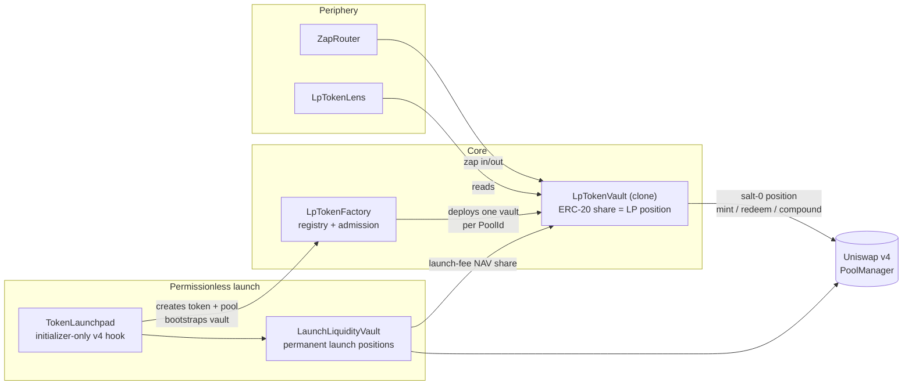

# lp{TOKEN} Contracts

[](https://github.com/Steemhunt/lptoken-contracts/actions/workflows/test.yml)
[](foundry.toml)
[](https://getfoundry.sh/)
[](https://github.com/Uniswap/v4-core)
[](LICENSE)

**lpTOKEN turns a Uniswap v4 LP position into a plain ERC-20 you can buy, hold, and
transfer like any token.** Every vault wraps exactly one pool: its share price is a
pro-rata claim on the position plus accrued fees, and a permissionless `compound`
folds trading fees back into liquidity. Holding `lpCASHCAT` is holding the
CASHCAT/ETH pool itself — a way to go long a token's *volume*, not just its price.

Live at **[lptoken.fun](https://lptoken.fun)**. Contract deployments are available on
[Base](#base-8453), [Robinhood Chain](#robinhood-chain-4663), and
[Arc mainnet](#arc-mainnet-5042).

## How it works



Two ways a vault comes to exist:

- **Permissionless launch** — `TokenLaunchpad` creates a fixed-supply token in a
  canonical native-currency v4 pool (1% static fee, tick spacing 200, the launchpad
  itself as an initializer-only hook, so the pool cannot be squatted or
  front-initialized). Every launch permanently locks a one-sided launch position,
  bootstraps the pool's `LpTokenVault`, and locks all initial lpTOKEN shares at the
  dead address. An optional creator buy executes atomically with deadline, minimum
  output, price limit, and exact partial-fill refund.
- **Curated launch** — the Factory owner can wrap an *existing*, already-initialized
  v4 pool (hookless, static fee ≥ 0.20%) after strict admission checks: recomputed
  PoolId, initialized `slot0`, minimum active liquidity, bounded tick deviation,
  readable target metadata, non-recursive legs. One vault per PoolId, forever.

### The vault

`LpTokenVault` is an immutable clone that owns exactly one position in its pool,
spanning a range `VaultRange` derives from each leg's supply (stopping short of the
usable-tick boundary, where saturating Uniswap's shared per-tick liquidity cap is
cheap enough to freeze later mints). Accounting is an exact two-currency pro-rata
claim — position principal, pending fees, launch-fee NAV allocation, idle balances —
with **no oracle, USD numeraire, or pool-wide reserve assumption anywhere**.

- `mintPair` / `redeem` — deposit or withdraw both legs at the current portfolio
  ratio; 30 bps fee charged in backed shares (bootstrap and ERC-20 transfers are
  free). Minting reproduces the current portfolio proportionally, so callback-capable
  tokens cannot dilute existing holders.
- `compound` — permissionless and swapless. Deploys at most a cap derived from the
  pool fee, a 50% safety factor, and the *protocol-owned* economic base (the vault's
  own position plus the locked launch position, counted only while in range). A
  round-trip price manipulation pays the LP fee both ways and can never repay the
  cap, so manipulated compounds lose money for the attacker. Successful calls start
  a 10-minute cooldown.
- **Launch-fee flywheel** — the locked launch position's fees split between the
  creator, lpTOKEN NAV, and the treasury (target leg 40/60 creator/NAV; counter leg
  40/20/40 creator/NAV/treasury). Distribution is permissionless, split-exact at
  1 wei, and failure-isolated: a reverting recipient gets a retryable claim and can
  never block vault operation.

### Periphery

- `ZapRouter` — optional single-asset entry/exit: converts native currency or the
  canonical stablecoin through at most three client-selected hookless v4 pools, then
  splits into the vault pair. Strict full-spend per hop, per-leg minimums, deadlines,
  callback authentication. No V3, no external aggregator calldata.
- `ZapRouterArc` — standalone Arc periphery for native USDC (18 decimals) and its
  ERC-20 interface (6 decimals). Both views share one balance: conversion changes
  units by `10^12`, without WETH `deposit()` / `withdraw()` calls. The router refunds
  conversion dust, preserves its pre-call balance, and rejects pools that pair the
  two USDC interfaces. The existing `ZapRouter` source remains unchanged.
- `LpTokenLens` — read-only aggregation of vault identity, pool context, and
  shareholder accounting (kept separate, so pool state is never presented as a
  claim).

## Security model

- **No admin over user funds.** Vaults are immutable clones; there is no pause, no
  upgrade path, no administrative reinvestment or withdrawal privilege. The Factory
  owner can only admit new pools; the treasury can only rotate itself via two-step
  handoff.
- **Reentrancy** — OpenZeppelin's EIP-1153 transient guard wraps every callback- or
  transfer-sensitive flow (requires Cancun, matching the reviewed v4 deployments).
- **Manipulation-resistance by construction** — the compound cap is sized so
  round-trip manipulation strictly loses; admission snapshots are re-checked after
  bootstrap transfers so callback-capable assets cannot invalidate them; forced ETH
  and direct donations accrue to existing holders and can never mint shares.
- **Adversarial test suite** — 333 non-fork tests plus mainnet-fork dry runs against
  the production `PoolManager` artifact (compiled with Uniswap's optimizer profile,
  not a mock). Highlights: `CompoundCapInsiderAttack` proves a launch creator armed
  with JIT liquidity and 1.1×–10,000× price swings loses on every round trip;
  `LpTokenInvariant` holds full-supply claims equal to assets under randomized
  mints, redeems, swaps, donations, compounds, and external liquidity;
  `VaultRange` fuzzes the boundary-saturation budget rule.

Found something? Please report privately via DM to
[@lptokenfun](https://x.com/lptokenfun) before public disclosure.

## Deployments

Deployment manifests with receipts, constructor arguments, source commits, and
runtime code hashes live in [`deployments/`](deployments).

### Robinhood Chain (4663)

| Contract | Address |
| --- | --- |
| LpTokenFactory | [`0xDd9b4a30FFf71A391A39FbaCed43e3DAa84dbC84`](https://robinhoodchain.blockscout.com/address/0xDd9b4a30FFf71A391A39FbaCed43e3DAa84dbC84) |
| LpTokenVault implementation | [`0xBaf91d6c83fe4B325ddD818aDaa9A39D490E6C6d`](https://robinhoodchain.blockscout.com/address/0xBaf91d6c83fe4B325ddD818aDaa9A39D490E6C6d) |
| TokenLaunchpad | [`0xC3612550Fd0f3095B6636110e5b06dD4eb05e000`](https://robinhoodchain.blockscout.com/address/0xC3612550Fd0f3095B6636110e5b06dD4eb05e000) |
| LaunchLiquidityVault | [`0x7FcA8E7a8376B38f3eb23F21e8C7b7c6E5f3f077`](https://robinhoodchain.blockscout.com/address/0x7FcA8E7a8376B38f3eb23F21e8C7b7c6E5f3f077) |
| ZapRouter | [`0x19e1AbAcB318C25D9888bBAa62cBaa69dA2F66c7`](https://robinhoodchain.blockscout.com/address/0x19e1AbAcB318C25D9888bBAa62cBaa69dA2F66c7) |
| LpTokenLens | [`0x8bA19810F56E455276a0Db1eaace071D75B08Fd2`](https://robinhoodchain.blockscout.com/address/0x8bA19810F56E455276a0Db1eaace071D75B08Fd2) |

### Base (8453)

| Contract | Address |
| --- | --- |
| LpTokenFactory | [`0x3384eD0d272dE35bF6DC516E1eA7d188CEb51793`](https://basescan.org/address/0x3384eD0d272dE35bF6DC516E1eA7d188CEb51793) |
| LpTokenVault implementation | [`0x78aae2fD8f8b09994d0e936Ce4478a7EB8FE92D9`](https://basescan.org/address/0x78aae2fD8f8b09994d0e936Ce4478a7EB8FE92D9) |
| TokenLaunchpad | [`0xED14eE7501fB212f876714a68308564cD6772000`](https://basescan.org/address/0xED14eE7501fB212f876714a68308564cD6772000) |
| LaunchLiquidityVault | [`0x39f3C534E6962Fd5fb0DD3653B6c16400c49C498`](https://basescan.org/address/0x39f3C534E6962Fd5fb0DD3653B6c16400c49C498) |
| ZapRouter | [`0xc4C8071D651F093C4A5c2C06e7BFfc163A057DdA`](https://basescan.org/address/0xc4C8071D651F093C4A5c2C06e7BFfc163A057DdA) |
| LpTokenLens | [`0x6DC57E44B995c56F91a6AD5f221F372C1c2FFBF5`](https://basescan.org/address/0x6DC57E44B995c56F91a6AD5f221F372C1c2FFBF5) |

### Arc mainnet (5042)

Deployed on September 9, 2026. The [Arc manifest](deployments/arc-mainnet.json)
records six successful transactions, constructor arguments, dependency and runtime
hashes, ownership and treasury wiring, and exact source SHA-256 hashes.

| Contract | Address |
| --- | --- |
| LpTokenFactory | [`0x37F540de37afE8bDf6C722d87CB019F30e5E406a`](https://arc-scan.org/address/0x37F540de37afE8bDf6C722d87CB019F30e5E406a) |
| LpTokenVault implementation | [`0x2c692DB9203EF651745AF2c07ebd587222D55a06`](https://arc-scan.org/address/0x2c692DB9203EF651745AF2c07ebd587222D55a06) |
| TokenLaunchpad | [`0xa790B0e77FD23504342404fc8DD0c5AE4DE4e000`](https://arc-scan.org/address/0xa790B0e77FD23504342404fc8DD0c5AE4DE4e000) |
| LaunchLiquidityVault | [`0x124ed8F31A4052cA910E98e5eC9bb182C88AB365`](https://arc-scan.org/address/0x124ed8F31A4052cA910E98e5eC9bb182C88AB365) |
| ZapRouterArc | [`0x905F3AE86108c6A3b1a345dACEaef6c4749Ec66a`](https://arc-scan.org/address/0x905F3AE86108c6A3b1a345dACEaef6c4749Ec66a) |
| LpTokenLens | [`0x5dfA75b0185efBaEF286E80B847ce84ff8a62C2d`](https://arc-scan.org/address/0x5dfA75b0185efBaEF286E80B847ce84ff8a62C2d) |

- **Pool quote:** native USDC, `address(0)`, 18 decimals. The ERC-20 interface at
  `0x3600000000000000000000000000000000000000` uses 6 decimals and exposes the same
  underlying balance; it is not an additional asset or a WETH-style wrapper.
- **Launch terms:** 1 USDC permanent seed per token launch; start tick `122000`;
  initial FDV approximately $5,033.52; 1% pool fee and tick spacing 200. Deployment
  itself funded no token seed.
- **Deployment cost:** 21,581,930 gas, totaling **0.4316386 USDC** across six
  transactions. Foundry's generic native-currency output may label these amounts
  as ETH; the denomination on Arc is USDC.
- **Validation:** 18 Arc Zap tests and 11 deployment/launch tests cover shared-balance
  conversion, dust, slippage rollback, native/ERC-20 mint and redeem, and the launch
  lifecycle. The USDC fixture models shared balances, not Arc's exact precompile
  execution or gas behavior. Local results do not establish a completed mainnet
  trading round trip.

The [Arc config](config/arc-mainnet.json) and
[deployment script](script/DeployLpTokenArc.s.sol) record the executed deployment.
The config pins the original signer at nonce zero and must not be reused to repeat
this production deployment. The shared core contracts and legacy `ZapRouter`
retain their existing source references.

## ETHOnline 2026

This repository is a Continuity Track submission to ETHOnline 2026, which runs from
September 4 to 16, 2026.

**Before the event.** The contracts were developed in the private lpTOKEN.fun
repository and published here on September 2, 2026 in
[`a9df830`](https://github.com/Steemhunt/lptoken-contracts/commit/a9df830f3c13daee3926afa32eb48cd7c9e2d3e5).
That commit holds the core contracts, the test suite, CI, and the deployment records for
Robinhood Chain and Base, which were already live.

**During the event.**

- Arc mainnet support, in
  [`edac3a1`](https://github.com/Steemhunt/lptoken-contracts/commit/edac3a1600a4ed613479cc3d5bc047f58cc83b96):
  `ZapRouterArc`, the Arc deployment script and config, the receipt-backed Arc
  manifest, and the Arc zap and deployment tests. These were committed to the private
  repository and published here the same day. The Arc deployment landed on
  September 9, 2026, in blocks 19930758 to 19930785.
- Arc support in the lpTOKEN.fun app and indexer, in the private repository.
- [`FEEDBACK.md`](FEEDBACK.md), our developer feedback for Uniswap.

## Getting started

```sh
git clone --recursive https://github.com/Steemhunt/lptoken-contracts.git
cd lptoken-contracts

forge build
./test/test-all.sh        # 333 non-fork tests
forge fmt --check
```

Dependencies are git submodules pinned to exact commits (also recorded in
[`foundry.lock`](foundry.lock) and verified by
[`script/verify-source-pins.sh`](script/verify-source-pins.sh)). If you cloned
without `--recursive`, run `git submodule update --init --recursive`.

### Fork tests

```sh
./test/test-fork.sh                                   # first working public Robinhood RPC
FORK_RPC_URL=https://your.rpc ./test/test-fork.sh     # explicit RPC
```

`test/test-fork.sh` runs every `test/LpTokenFork*.t.sol` suite: full lifecycle dry
runs against the production PoolManager, Universal Router, and Permit2, plus
replayed compound incidents. Public-endpoint runs are latest-state smoke tests; pin
`FORK_RPC_URL` + `FORK_BLOCK_NUMBER` on an archive node for reproducible release
checks.

## Repository layout

```text
src/TokenLaunchpad.sol          fixed-supply token + lpTOKEN launcher (v4 hook)
src/LaunchToken.sol             launch token with creator metadata
src/LaunchLiquidityVault.sol    permanent launch positions + fee distribution
src/LpTokenFactory.sol          vault registry, admission, launchpad binding
src/LpTokenVault.sol            immutable vault (clone target, ERC-20 share)
src/interfaces/                 core and launch fee-source interfaces
src/libraries/                  launch config, vault range, currency helpers
src/periphery/LpTokenLens.sol   read-only aggregation
src/periphery/ZapRouter.sol     restricted v4 zap routing
src/periphery/ZapRouterArc.sol  Arc shared-USDC zap routing
script/DeployLpToken.s.sol      full deployment + wiring validation
script/DeployLpTokenArc.s.sol   executed Arc deployment + preflight validation
config/                         per-chain deployment inputs
deployments/                    receipt-backed deployment manifests
test/                           unit, invariant, simulation, and fork suites
```

Liquidity sizing uses the pinned official v4-periphery `LiquidityAmounts` library;
amount math uses pinned v4-core `SqrtPriceMath` / `FullMath`.

## Deployment

```sh
cp .env.example .env   # signer key, final owner, RPC
forge script script/DeployLpToken.s.sol --rpc-url "$ROBINHOOD_RPC_URL" --broadcast
```

The script verifies the chain ID and the reviewed PoolManager / canonical-stable /
wrapped-native runtime code hashes, deploys the Factory (which deploys the vault
implementation), CREATE2-mines the `TokenLaunchpad` hook address, deploys the shared
`LaunchLiquidityVault`, `ZapRouter`, and `LpTokenLens`, permanently binds the
launchpad, asserts the resulting wiring, and transfers Factory ownership to the
reviewed final owner. Manifests in `deployments/` are written only after receipt
validation.

## License

Project-authored Solidity sources, scripts, and tests are licensed under the
[BSD 3-Clause License](LICENSE). Dependencies under `lib/` retain their own
licenses.
